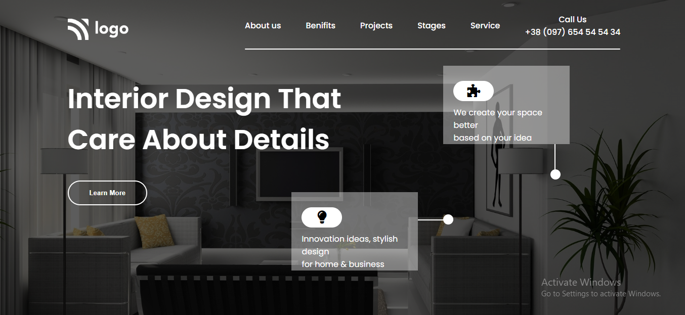

# Assignment 1

# Project 10

### What I Learned from this Project?

- Learned to use flex grow, shrink & basis
- Learned about various CSS Properties
- Used various Psuedo Classes.

### This project took around 6 hours to complete.

### Project Link : [Link](https://interior-design-page-dashboard.netlify.app/)

### Screenshot

